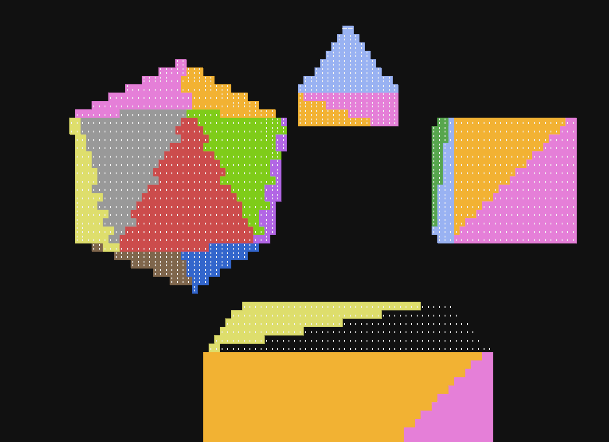

# computercraft 3D rendering
ThreeDeeh is very WIP computercraft 3d rendering engine

# demos:
Shape demo:
  in this demo you can click on bunch of objects (2 cubes 1 pyramid 1 broken icosahedron) to select them
  and then press w,s,a,d,shift,space to move them around and arrow keys to rotate them
  

